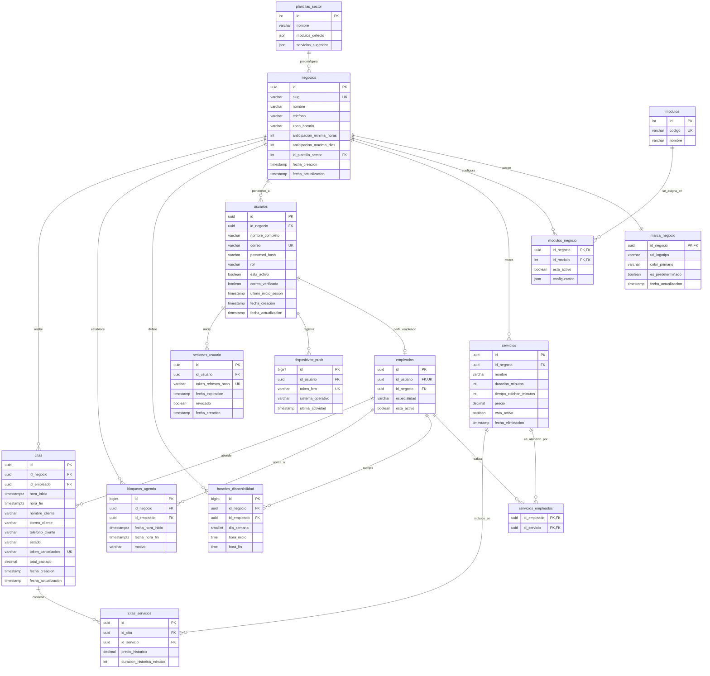
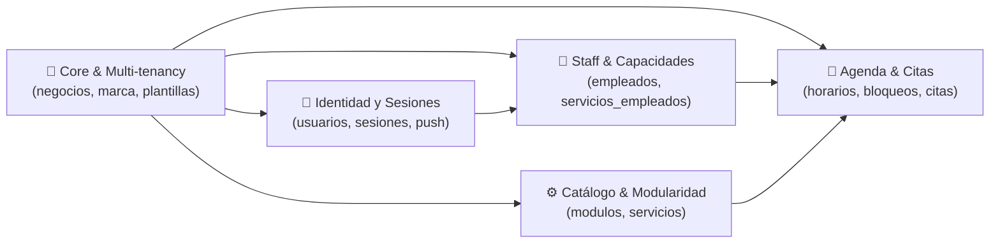

---
tags:
  - base-de-datos
  - er-diagram
  - proyecto
  - sql
  - arquitectura
  - persistencia
---

# 🗄️ Modelo de Base de Datos del Proyecto (ERD)

> [!abstract] Resumen del Modelo
> Esquema relacional multi-inquilino (*multi-tenant*) diseñado para una plataforma de gestión de citas, servicios, horarios, módulos configurables y autenticación de usuarios y empleados, con soporte para notificaciones push y auditoría histórica de reservas.

---

## 📊 1. Diagrama Entidad-Relación (Mermaid ERD)

---

## 🏛️ 2. Módulos y Dominios del Sistema

El esquema se divide en 5 dominios de negocio claramente delimitados:

---

## 📋 3. Diccionario de Entidades y Estructura

### 🏢 A. Núcleo de Negocio y Multi-inquilino (*Multi-tenancy*)

#### `plantillas_sector`
Preconfiguraciones por industria (ej. barberías, clínicas, consultorías).
- `id` (INT PK): Identificador autoincremental.
- `nombre` (VARCHAR): Nombre del sector (ej. "Salón de Belleza", "Médico").
- `modulos_defecto` (JSON): Lista de códigos de módulos activados por defecto.
- `servicios_sugeridos` (JSON): Catálogo de servicios plantilla para onboarding rápido.

#### `negocios`
Inquilino raíz (*Tenant*) que aísla los datos de cada establecimiento.
- `id` (UUID PK): Identificador único global.
- `slug` (VARCHAR UK): Identificador amigable para URL y reservas públicas (ej. `/reservas/barberia-elite`).
- `nombre`, `telefono`, `zona_horaria`: Datos de contacto y contexto temporal.
- `anticipacion_minima_horas` / `anticipacion_maxima_dias`: Reglas de negocio para agendamiento.
- `id_plantilla_sector` (INT FK): Plantilla base utilizada.
- `fecha_creacion`, `fecha_actualizacion`: Marcas de tiempo de auditoría.

#### `marca_negocio`
Identidad visual y personalización de marca (*White-label*). Relación 1:1 con `negocios`.
- `id_negocio` (UUID PK, FK): Clave primaria y foránea compartida.
- `url_logotipo`: Enlace al asset alojado en almacenamiento seguro.
- `color_primario`: Color hexadecimal de la interfaz.
- `es_predeterminado`: Flag booleano de personalización activa.

---

### 🔐 B. Identidad, Autenticación y Dispositivos Móviles

#### `usuarios`
Cuentas de acceso al sistema para administradores, recepcionistas y empleados.
- `id` (UUID PK): Identificador de usuario.
- `id_negocio` (UUID FK): Inquilino al que pertenece.
- `correo` (VARCHAR UK): Correo único para login.
- `password_hash` (VARCHAR): Hash seguro mediante Argon2id o bcrypt.
- `rol` (VARCHAR): Rol del sistema (`ADMIN`, `RECEPCION`, `EMPLEADO`).
- `esta_activo`, `correo_verificado`: Estados de cuenta.

#### `sesiones_usuario`
Control de tokens de refresco (*Refresh Tokens*) para autenticación segura en móvil/web.
- `id` (UUID PK): Identificador de sesión.
- `id_usuario` (UUID FK): Usuario autenticado.
- `token_refresco_hash` (VARCHAR UK): Hash criptográfico del token de refresco.
- `fecha_expiracion`: Tiempo de expiración del token.
- `revocado`: Flag de revocación inmediata (cierre de sesión remoto).

#### `dispositivos_push`
Registro de dispositivos móviles para notificaciones push vía FCM / APNs.
- `id` (BIGINT PK): Identificador del registro.
- `id_usuario` (UUID FK): Propietario del dispositivo.
- `token_fcm` (VARCHAR UK): Token de Firebase Cloud Messaging.
- `sistema_operativo`: `ANDROID`, `IOS`, `WEB`.
- `ultima_actividad`: Timestamp para limpieza de tokens inactivos.

---

### ⚙️ C. Módulos y Catálogo de Servicios

#### `modulos` & `modulos_negocio`
Sistema de activación de funciones a la medida (*Feature Flags* y suscripción por módulos).
- `modulos`: Catálogo maestro de módulos del sistema (`FACTURACION`, `RECORDATORIOS_SMS`, `MARKETING`).
- `modulos_negocio`: Tabla asociativa con campo `configuracion` (JSON) para almacenar ajustes específicos por negocio.

#### `servicios` & `servicios_empleados`
- `servicios`: Catálogo de prestaciones con control de `duracion_minutos`, `tiempo_colchon_minutos` (tiempo de limpieza/preparación entre citas), `precio` y borrado lógico mediante `fecha_eliminacion` (*Soft Delete*).
- `servicios_empleados`: Tabla puente M:N para asignar qué colaboradores realizan qué servicios específicos.

---

### 📅 D. Agenda, Disponibilidad y Citas

#### `horarios_disponibilidad`
Matriz de jornada laboral semanal recurrente por colaborador o negocio.
- `dia_semana` (SMALLINT): 0 (Domingo) a 6 (Sábado) o 1 a 7 según norma ISO.
- `hora_inicio`, `hora_fin` (TIME): Rango de disponibilidad horaria.

#### `bloqueos_agenda`
Excepciones puntuales a la disponibilidad (vacaciones, citas médicas, mantenimiento).
- `fecha_hora_inicio`, `fecha_hora_fin` (TIMESTAMPTZ): Intervalo exacto con zona horaria UTC.
- `motivo` (VARCHAR): Razón del bloqueo.

#### `citas` & `citas_servicios`
Núcleo transaccional de reservas:
- `citas`:
  - `hora_inicio`, `hora_fin` (TIMESTAMPTZ): Período pactado de atención.
  - `nombre_cliente`, `correo_cliente`, `telefono_cliente`: Datos de contacto del cliente final.
  - `estado`: `PENDIENTE`, `CONFIRMADA`, `CANCELADA`, `COMPLETADA`, `NO_ASISTIO`.
  - `token_cancelacion` (VARCHAR UK): Token seguro e irrepetible para que el cliente gestione o cancele su cita sin login.
  - `total_pactado`: Monto total de la reserva.
- `citas_servicios`:
  - **Inmutabilidad y Auditoría Histórica:** Almacena `precio_historico` y `duracion_historica_minutos` para evitar que futuras modificaciones del catálogo alteren citas pasadas o en curso.

---

## 💡 4. Decisiones de Arquitectura y Buenas Prácticas Aplicadas

> [!tip] 1. Multi-inquilino con Aislamiento Lógico (Multi-tenancy)
> Todas las tablas principales poseen `id_negocio` como clave foránea, permitiendo consultas seguras con filtrado por inquilino y soporte de Row Level Security (RLS) en PostgreSQL.

> [!tip] 2. Manejo de Zonas Horarias (`TIMESTAMPTZ`)
> Las citas y bloqueos utilizan marcas de tiempo con zona horaria integrada (`TIMESTAMPTZ`) almacenadas en UTC en el backend y convertidas a la `zona_horaria` del negocio en las vistas cliente.

> [!tip] 3. Integridad y Auditoría Histórica
> La tabla `citas_servicios` congela el precio y la duración pactados en el momento de la creación de la cita, desacoplando el histórico contable de cambios futuros en la tabla `servicios`.

> [!tip] 4. Seguridad "Zero Trust" en Autenticación
> Las contraseñas y tokens de refresco nunca se guardan en texto plano (`password_hash`, `token_refresco_hash`). La revocación de sesiones es inmediata mediante la columna `revocado`.

---

## 🔗 Conexiones y Referencias

- 💾 Persistencia y propiedades ACID: [[Dilema de almacenamiento]]
- 🛡️ Autenticación stateless y Zero Trust: [[Seguridad]]
- 🌐 Consumo y endpoints RESTful: [[Api rest y rest full]]
- 📱 Ciclo de vida y refresco de estado en móvil: [[ciclo de vida de la aplicación]]
- 📐 Arquitectura de capas y repositorios: [[Arquitecturas de Software Movil y Backend]]
- 🤖 Reglas y directrices de desarrollo: [[AGENTS.md]]
- 🏠 Mapa de Contenidos Principal: [[Desarrollo movil integral]]
