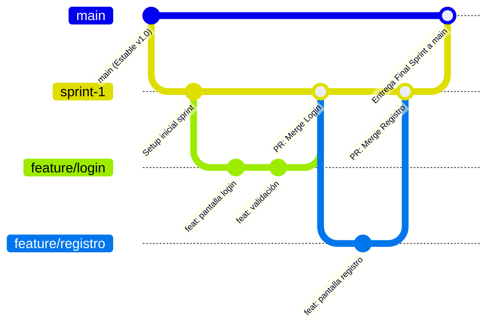
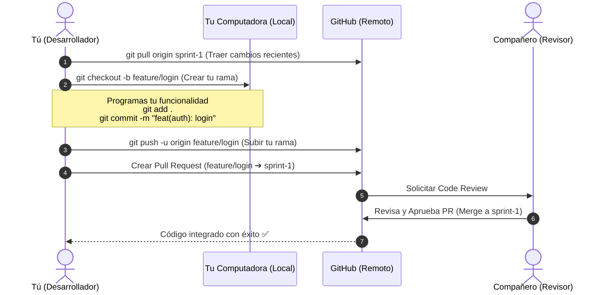
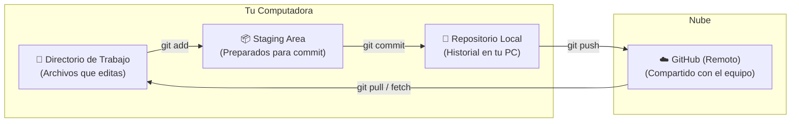
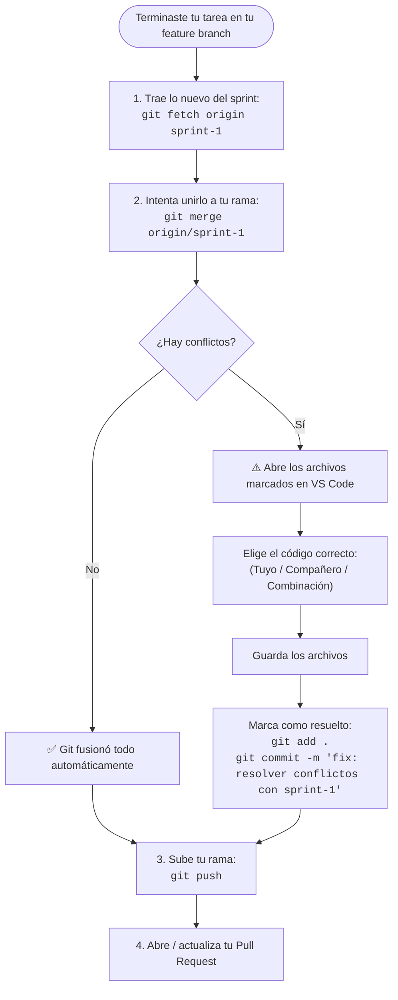

# Guía Rápida de Git para el Equipo 

Esta guía explica de forma sencilla y visual cómo trabajamos con Git y GitHub en nuestro proyecto escolar para mantener el orden, evitar dolores de cabeza y prevenir conflictos al unir nuestro código.

---

## 1. ¿Cómo se conectan las ramas?

Para no romper el proyecto, utilizamos tres niveles de ramas muy claros:



### Roles de cada rama:

* **`main`**: Es la rama oficial y sagrada. Solo recibe código cuando un Sprint termina, se prueba y funciona perfectamente. **Nadie programa directamente en `main`**.
* **`sprint-X`** *(ej. `sprint-1`, `sprint-2`)*: Es la zona de integración y pruebas del ciclo actual. Aquí se junta todo lo que el equipo va completando.
* **`feature/nombre-tarea`** *(ej. `feature/login`, `feature/perfil`)*: Es tu zona de trabajo personal. La creas a partir del sprint actual para desarrollar tu tarea sin estorbar a nadie.

---

## 2. El Ciclo de Trabajo: Paso a Paso

Imagina que te asignaron la tarea de programar el login. Este es el flujo de comunicación entre tu computadora y GitHub:



### Comandos que usarás en el día a día:

#### 1. Actualizar tu base
Antes de empezar a programar, asegúrate de tener la rama del sprint al día:
```bash
git checkout sprint-1
git pull origin sprint-1
```

#### 2. Crear tu rama de trabajo
Parte siempre desde la rama del sprint dándole un nombre claro a tu tarea:
```bash
git checkout -b feature/login sprint-1
```

#### 3. Guardar tus avances (Commits)
Haz commits pequeños y claros explicando qué hiciste usando *Conventional Commits* (`feat:`, `fix:`, `docs:`, etc.):
```bash
git add .
git commit -m "feat(auth): añadir diseño del formulario"
```

#### 4. Subir tu rama a GitHub
La primera vez que subas tu rama ejecuta:
```bash
git push -u origin feature/login
```
*(En subidas posteriores de la misma rama, basta con hacer `git push`)*.

#### 5. Abrir tu Pull Request (PR)
1. Ve a GitHub.
2. Crea un **Pull Request** pidiendo unir tu rama `feature/login` hacia `sprint-1`.
3. Pide a un compañero que revise tu código (**Code Review**) antes de fusionarlo.

---

## 3. Las 4 Áreas de Git: ¿Dónde están mis cambios?

Para entender qué hace cada comando, este diagrama muestra el viaje que hace tu código:



---

## 4. ¿Cómo prevenir y resolver conflictos? 🛡️

Un conflicto ocurre cuando dos personas modifican la **misma línea del mismo archivo** al mismo tiempo.

### Diagrama de Decisión para Resolver Conflictos:



### Paso a paso en la terminal para actualizar tu rama:

Estando parado en tu rama de trabajo (`feature/...`), ejecuta:

```bash
# 1. Trae los cambios más recientes del sprint
git fetch origin sprint-1

# 2. Únelos a tu rama actual
git merge origin/sprint-1
```

* **Si todo sale bien:** ¡Listo! Git combina el código de forma automática.
* **Si hay conflicto:** Git te avisará qué archivos tienen problemas:
  1. Abre el archivo en VS Code. Verás las opciones: *Accept Current Change*, *Accept Incoming Change*, o *Accept Both Changes*.
  2. Elige la opción adecuada y guarda.
  3. Ejecuta:
     ```bash
     git add .
     git commit -m "fix: resolver conflicto con sprint-1"
     git push
     ```

> 💡 **Regla de oro:** Resolver los conflictos en tu propia rama local antes de hacer el PR protege la rama del sprint y evita romper el trabajo del resto del equipo.